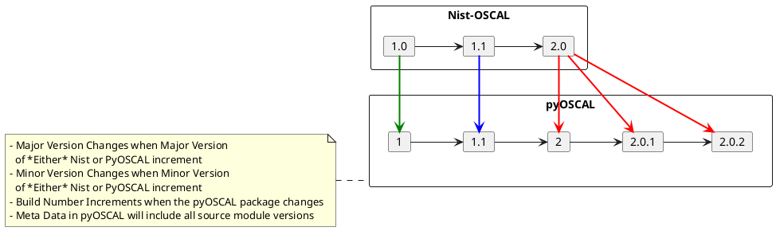

# pyOSCAL-Builder

Python Script/Tool to create the pyOSCAL library from the NIST released MetaSchema

## Architecture

```plantuml
left to right direction

folder "OSCAL/src/metaschema" as metaschema
file "parse_meta.py" as parser
folder "pyoscal" as pyoscal
folder "oscal-content" as examples
file "unit_test.py" as unittest
component "objects" as pyobjects
file "Output XML" as output_xml
file "Class Diagram UML" as output_uml

metaschema --> parser
parser --> pyoscal : multiple classes
pyoscal -> unittest : import
examples --> unittest : parse examples
unittest <-> pyobjects
unittest --> output_xml
unittest --> output_uml
```

## Versioning 

Currently only using Master Branch until proper project cadence and Minimal Viable Product is achieved.

Below is the planned versioning methodology that will be used once tagged releases are established.

